# 🛡️ Security-First Deployment Guide

## Overview

This guide provides comprehensive instructions for setting up enterprise-grade automated GitHub-to-Vercel deployment with advanced security controls for the Kasama AI platform.

## 📋 Required GitHub Secrets

### Core Vercel Integration
```bash
# Required for Vercel deployment
VERCEL_TOKEN=your-vercel-token-here
VERCEL_ORG_ID=your-org-id-here  
VERCEL_PROJECT_ID=your-project-id-here
```

### Application Environment Variables
```bash
# Supabase Configuration (Production)
VITE_SUPABASE_URL=https://your-project.supabase.co
VITE_SUPABASE_ANON_KEY=your-anon-key-here

# AI Service Configuration
VITE_CLAUDE_API_KEY=your-claude-api-key
VITE_CLAUDE_MODEL=claude-3-5-sonnet-20241022
VITE_OPENAI_API_KEY=your-openai-api-key
VITE_OPENAI_MODEL=gpt-4

# Analytics & Monitoring (Optional)
VITE_GOOGLE_ANALYTICS_ID=G-XXXXXXXXXX
VITE_MIXPANEL_TOKEN=your-mixpanel-token
VITE_SENTRY_DSN=your-sentry-dsn
```

## 🔧 Setup Instructions

### 1. GitHub Repository Secrets Configuration

**Navigate to your GitHub repository:**
```
Settings → Secrets and variables → Actions
```

**Add the following Repository Secrets:**

| Secret Name | Description | How to Obtain |
|-------------|-------------|---------------|
| `VERCEL_TOKEN` | Vercel API token with deployment permissions | [Vercel Dashboard → Settings → Tokens](https://vercel.com/account/tokens) |
| `VERCEL_ORG_ID` | Your Vercel organization/team ID | Run `vercel whoami` in terminal |
| `VERCEL_PROJECT_ID` | Kasama AI project ID on Vercel | Vercel Dashboard → Project Settings → General |
| `VITE_SUPABASE_URL` | Production Supabase project URL | Supabase Dashboard → Settings → API |
| `VITE_SUPABASE_ANON_KEY` | Production Supabase anonymous key | Supabase Dashboard → Settings → API |
| `VITE_CLAUDE_API_KEY` | Claude AI API key | [Anthropic Console](https://console.anthropic.com/) |
| `VITE_OPENAI_API_KEY` | OpenAI API key (fallback) | [OpenAI API Keys](https://platform.openai.com/api-keys) |

### 2. Environment Protection Rules

**Create Protected Environments:**

1. **Staging Environment**
   - Navigate to: `Settings → Environments → New environment`
   - Name: `staging`
   - Protection rules: None (auto-deploy)

2. **Production Environment**
   - Navigate to: `Settings → Environments → New environment`
   - Name: `production`
   - Protection rules:
     - ✅ Required reviewers: Add 1-2 reviewers
     - ✅ Wait timer: 5 minutes
     - ✅ Deployment branches: `main` only

3. **Production Approval Environment**
   - Name: `production-approval`
   - Protection rules:
     - ✅ Required reviewers: Add deployment approvers
     - ✅ Wait timer: 10 minutes
     - ✅ Deployment branches: `main` only

### 3. Branch Protection Rules

**Configure Main Branch Protection:**
```
Settings → Branches → Add rule
```

**Branch Protection Settings:**
- Branch name pattern: `main`
- ✅ Require a pull request before merging
  - ✅ Require approvals: 1
  - ✅ Dismiss stale reviews
  - ✅ Require review from code owners
- ✅ Require status checks to pass before merging
  - ✅ Require branches to be up to date before merging
  - Required status checks:
    - `TypeScript Type Check`
    - `ESLint Code Quality`
    - `Prettier Format Check`
    - `Build Application`
    - `Security Scan Summary`
- ✅ Require conversation resolution before merging
- ✅ Restrict pushes that create files
- ✅ Do not allow bypassing the above settings

## 🚀 Deployment Pipeline Architecture

### Security-First Pipeline Stages

```mermaid
graph TD
    A[Code Push to main] --> B[Security Pre-flight Check]
    B --> C{Risk Score < 50?}
    C -->|Yes| D[Pre-deployment Validation]
    C -->|No| E[Deployment Blocked]
    D --> F[Production Approval Gate]
    F --> G[Vercel Deployment]
    G --> H[Comprehensive Health Check]
    H --> I{Health Score ≥ 80?}
    I -->|Yes| J[Deployment Complete]
    I -->|No| K[Automatic Rollback]
```



### Stage Details

#### 1. Security Pre-flight Check
- **Purpose**: Early security validation before resource-intensive operations
- **Checks**:
  - Sensitive files in commit detection
  - Hardcoded secrets scanning
  - Branch validation
  - Risk score calculation (0-100)
- **Success Criteria**: Risk score < 50
- **Bypass**: Emergency flag available (`skip_security_scan`)

#### 2. Pre-deployment Validation
- **Purpose**: Code quality and build validation
- **Checks**:
  - TypeScript compilation
  - ESLint code quality
  - Production build success
  - High-severity vulnerability scan
- **Success Criteria**: All checks must pass

#### 3. Production Approval Gate
- **Purpose**: Human oversight for production deployments
- **Trigger**: Only for production environment deployments
- **Requirements**: 
  - Manual approval from designated reviewers
  - 10-minute wait timer
  - Deployment metadata review

#### 4. Vercel Deployment
- **Purpose**: Secure application deployment to Vercel
- **Features**:
  - Deployment metadata tagging
  - Environment-specific configuration
  - Deployment ID tracking
  - Success validation

#### 5. Comprehensive Health Check
- **Purpose**: Multi-dimensional post-deployment validation
- **Checks** (100-point scoring system):
  - Basic connectivity (20 points)
  - Response time < 3s (20 points)
  - HTTP status 200 (20 points)
  - Security headers present (20 points)
  - Content validation (20 points)
- **Success Criteria**: Health score ≥ 80

#### 6. Intelligent Rollback System
- **Purpose**: Automatic recovery from deployment failures
- **Triggers**: Health check failure + auto-rollback enabled
- **Process**:
  - Find last stable production deployment
  - Validate previous deployment health
  - Automatic alias switching
  - Rollback status reporting

## 🔐 Security Features

### Multi-layered Security Validation

#### Layer 1: Pre-commit Security
- **Husky Integration**: Client-side pre-commit hooks
- **Secret Detection**: Prevents accidental secret commits
- **Format Enforcement**: Prettier and ESLint validation

#### Layer 2: CI Pipeline Security
- **Dependency Audit**: npm audit with severity thresholds
- **CodeQL Analysis**: Static application security testing
- **Secret Scanning**: TruffleHog OSS integration
- **License Compliance**: Automated license checking

#### Layer 3: Deployment Security
- **Risk Assessment**: Automated deployment risk scoring
- **Environment Isolation**: Staging/production separation
- **Approval Gates**: Human oversight for critical deployments
- **Security Headers**: Automatic security header validation

#### Layer 4: Runtime Security
- **Health Monitoring**: Continuous application health checks
- **Performance Monitoring**: Response time and availability tracking
- **Security Header Validation**: Runtime security configuration verification
- **Automatic Rollback**: Failure detection and recovery

### Security Metrics & Monitoring

#### Key Security Indicators (KSIs)
- **Deployment Risk Score**: 0-100 scale (target: < 20)
- **Health Check Score**: 0-100 scale (target: ≥ 80)
- **Security Header Coverage**: Target: 3/3 headers present
- **Vulnerability Count**: Target: 0 high/critical vulnerabilities
- **Response Time**: Target: < 3 seconds
- **Availability**: Target: 99.9% uptime

## 🚨 Emergency Procedures

### Emergency Deployment Override
```bash
# Skip security validation (use with extreme caution)
gh workflow run deploy.yml \
  --ref main \
  -f environment=production \
  -f skip_security_scan=true \
  -f rollback_on_failure=true
```

### Manual Rollback Procedure
```bash
# Get deployment history
vercel ls --token=$VERCEL_TOKEN

# Set alias to previous deployment
vercel alias set PREVIOUS_DEPLOYMENT_URL app.kasama.ai --token=$VERCEL_TOKEN
```

### Incident Response Workflow
1. **Detection**: Automated alerts or manual discovery
2. **Assessment**: Health check and security validation
3. **Containment**: Automatic rollback or manual intervention
4. **Investigation**: Root cause analysis
5. **Recovery**: Fix deployment and validate
6. **Post-mortem**: Document lessons learned

## 📊 Monitoring & Alerting

### GitHub Actions Integration
- **Deployment Status**: Real-time deployment tracking
- **Security Alerts**: Automated security finding notifications
- **Health Monitoring**: Post-deployment validation results
- **Performance Metrics**: Response time and availability tracking

### Recommended External Monitoring
- **Vercel Analytics**: Built-in performance monitoring
- **Sentry**: Error tracking and performance monitoring
- **Google Analytics**: User experience monitoring
- **UptimeRobot**: External availability monitoring

## 🔄 Deployment Workflows

### Automatic Deployment (Main Branch)
```
1. Push to main → Security pre-flight → Validation → Production approval → Deploy → Health check
2. Success: Live deployment
3. Failure: Automatic rollback (if enabled)
```

### Manual Deployment (Any Environment)
```
1. GitHub Actions → Run workflow → Select environment → Manual approval (if production) → Deploy
2. Staging: No approval required
3. Production: Requires approval gate
```

### Rollback Scenarios
- **Health Check Failure**: Automatic rollback to previous stable deployment
- **Manual Rollback**: Via GitHub Actions or Vercel CLI
- **Emergency Rollback**: Direct Vercel dashboard intervention

## 🧪 Testing the Pipeline

### Pre-deployment Testing
```bash
# Local validation before pushing
npm run typecheck
npm run lint
npm run build
npm run test
```

### Pipeline Testing
```bash
# Test staging deployment
gh workflow run deploy.yml --ref main -f environment=staging

# Test production deployment (requires approval)
gh workflow run deploy.yml --ref main -f environment=production
```

## 📝 Maintenance & Updates

### Regular Security Maintenance
- **Weekly**: Review security scan results
- **Monthly**: Update dependencies and review vulnerabilities
- **Quarterly**: Security audit and penetration testing
- **Annually**: Complete security architecture review

### Pipeline Optimization
- Monitor deployment times and optimize for efficiency
- Review and update security thresholds based on threat landscape
- Enhance health check criteria based on application evolution
- Update documentation and runbooks

## 🎯 Success Metrics

### Deployment Quality Metrics
- **Success Rate**: Target ≥ 95%
- **Rollback Rate**: Target < 5%
- **Mean Time to Deploy**: Target < 10 minutes
- **Mean Time to Recover**: Target < 5 minutes

### Security Metrics
- **Security Incidents**: Target: 0 per quarter
- **Vulnerability Remediation Time**: Target < 24 hours
- **Compliance Score**: Target: 100%
- **Security Training Completion**: Target: 100% team coverage

---

**Document Version**: 1.0  
**Last Updated**: August 31, 2025  
**Next Review**: September 30, 2025  

This guide ensures enterprise-grade security for the Kasama AI deployment pipeline while maintaining development velocity and operational excellence.