# Kasama.ai Component Hierarchy

## Application Component Tree

```mermaid
graph TD
    App[App.jsx]

    subgraph "Routing Layer"
        BrowserRouter[BrowserRouter]
        Routes[Routes]
        Navigate[Navigate]
    end

    subgraph "Context Providers"
        AuthProvider[AuthProvider]
        ErrorBoundary[ErrorBoundary]
    end

    subgraph "Layout Components"
        Navigation[Navigation Bar]
        BottomTabNav[BottomTabNavigation]
    end

    subgraph "Authentication Pages"
        LoginPage[LoginPage]
        SignupPage[SignupPage]
        ResetPasswordPage[ResetPasswordPage]

        LoginForm[Login Component]
        SignupForm[Signup Component]
        PasswordResetForm[PasswordReset Component]
        SocialAuth[SocialAuth Component]
        UpdatePassword[UpdatePassword Component]
    end

    subgraph "Protected Pages"
        ProtectedRoute[ProtectedRoute Wrapper]

        DashboardHome[DashboardHome]
        ProfileSettings[ProfileSettings]
        LearnPractices[LearnPractices]
        ProgressTracking[ProgressTracking]
        RelationshipAssessment[RelationshipAssessment]
        WelcomeOnboarding[WelcomeOnboarding]
    end

    subgraph "Dashboard Components"
        WelcomeHeader[WelcomeHeader]
        DailyInsightCard[DailyInsightCard]
        StatsGrid[StatsGrid]
        DevelopmentJourney[DevelopmentJourney]
        QuickActions[QuickActions]
        RecentActivity[RecentActivity]
    end

    subgraph "UI Components"
        Button[Button]
        Input[Input]
        Select[Select]
        Checkbox[Checkbox]
        ProgressBar[ProgressBar]
        ProfileModal[ProfileModal]
        AssessmentFlow[AssessmentFlow]
    end

    subgraph "Utility Components"
        ScrollToTop[ScrollToTop]
        AppIcon[AppIcon]
        AppImage[AppImage]
    end

    App --> BrowserRouter
    BrowserRouter --> AuthProvider
    AuthProvider --> ErrorBoundary
    ErrorBoundary --> Navigation
    ErrorBoundary --> Routes
    ErrorBoundary --> BottomTabNav

    Routes --> LoginPage
    Routes --> SignupPage
    Routes --> ResetPasswordPage
    Routes --> ProtectedRoute

    LoginPage --> LoginForm
    SignupPage --> SignupForm
    ResetPasswordPage --> PasswordResetForm

    LoginForm --> SocialAuth
    SignupForm --> SocialAuth

    ProtectedRoute --> DashboardHome
    ProtectedRoute --> ProfileSettings
    ProtectedRoute --> LearnPractices
    ProtectedRoute --> ProgressTracking
    ProtectedRoute --> RelationshipAssessment
    ProtectedRoute --> WelcomeOnboarding

    DashboardHome --> WelcomeHeader
    DashboardHome --> DailyInsightCard
    DashboardHome --> StatsGrid
    DashboardHome --> DevelopmentJourney
    DashboardHome --> QuickActions
    DashboardHome --> RecentActivity
    DashboardHome --> ProfileModal

    WelcomeHeader --> Button
    DailyInsightCard --> Button
    StatsGrid --> ProgressBar
    QuickActions --> Button
    ProfileModal --> Input
    ProfileModal --> Button
```

## Component Responsibility Matrix

## State Management by Component

## Component Communication Flow

## Component Lifecycle Patterns

## Component Dependencies

## Component Testing Strategy (Recommended)

---

## Component Analysis Summary

### Strengths

- ✅ Clear separation of concerns (auth, dashboard, learning)
- ✅ Reusable UI component library
- ✅ Protected route implementation
- ✅ Form validation with React Hook Form + Zod

### Weaknesses

- ❌ No component documentation
- ❌ No component testing
- ❌ Inconsistent state management (Context + Redux + local)
- ❌ No performance optimization (memo, lazy loading)
- ⚠️ Limited error boundaries

### Recommendations

1. **Implement Component Documentation** - Use Storybook or similar
2. **Add Component Tests** - Start with critical auth and form components
3. **Standardize State Management** - Choose Redux OR Context, not both
4. **Optimize Performance** - Add React.memo, useMemo, lazy loading
5. **Improve Error Handling** - Add error boundaries at route level

### Component Metrics

- **Total Components:** ~40
- **Container Components:** 8 pages
- **Presentational Components:** ~25
- **Utility Components:** ~7
- **Average Component Size:** ~150 lines
- **Component Test Coverage:** 0%
