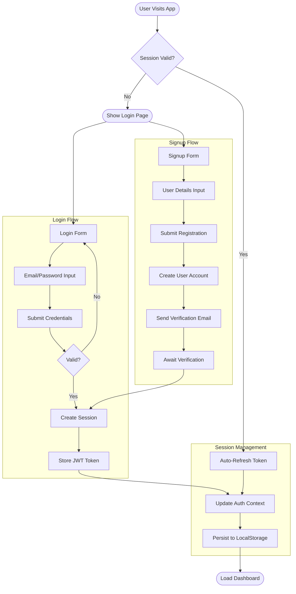
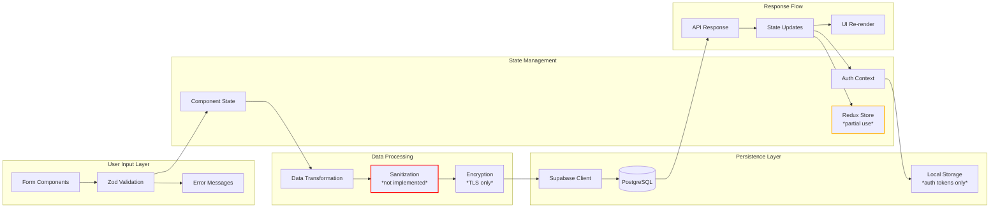
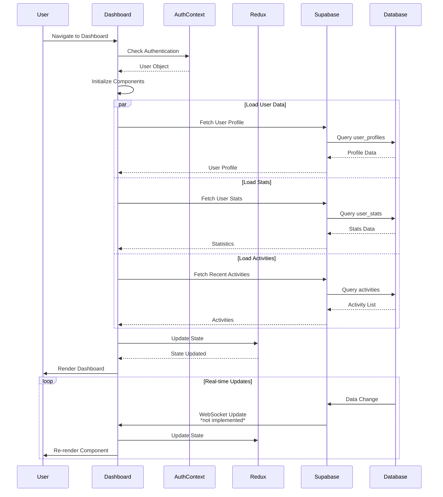
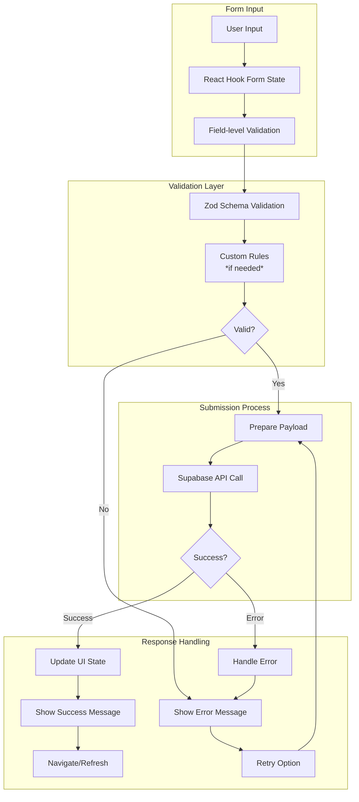
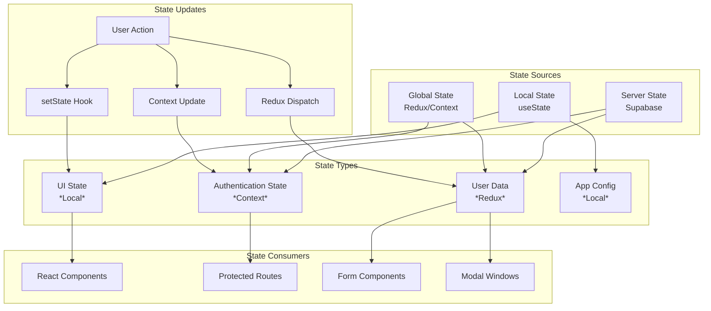
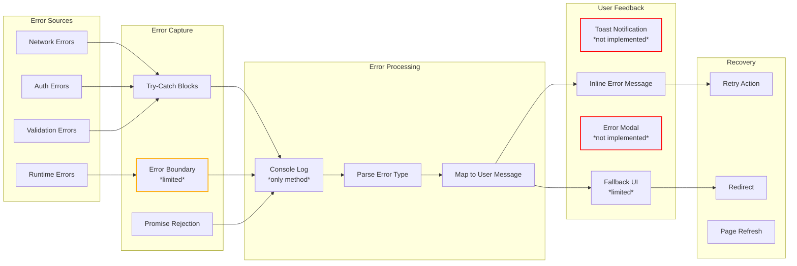
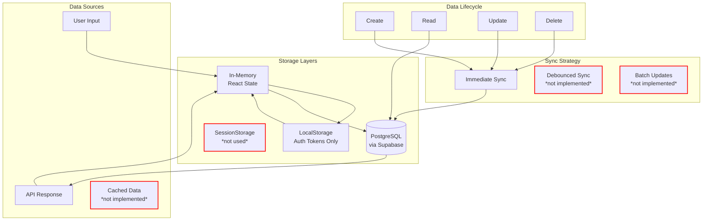

# Kasama.ai Data Flow Diagrams

## Authentication Data Flow

## User Data Flow

## Dashboard Data Flow

## Form Submission Flow

## State Management Flow

## Error Handling Flow

## Data Persistence Flow

## Real-time Data Flow (Planned)

```mermaid
flowchart LR
    subgraph "Event Sources"
        UserAction[User Actions]
        SystemEvent[System Events]
        ExternalTrigger[External Triggers]
    end

    subgraph "Real-time Pipeline"
        WebSocket[WebSocket Connection<br/>*not implemented*]
        SupabaseRealtime[Supabase Realtime<br/>*not configured*]
        EventStream[Event Stream]
    end

    subgraph "Event Processing"
        Filter[Event Filtering]
        Transform[Event Transform]
        Aggregate[Aggregation<br/>*if needed*]
    end

    subgraph "State Updates"
        OptimisticUpdate[Optimistic Update]
        PessimisticUpdate[Pessimistic Update]
        Reconciliation[State Reconciliation]
    end

    subgraph "UI Updates"
        ComponentRerender[Component Re-render]
        Notification[User Notification]
        Animation[UI Animation]
    end

    UserAction --> WebSocket
    SystemEvent --> WebSocket
    ExternalTrigger --> SupabaseRealtime

    WebSocket --> EventStream
    SupabaseRealtime --> EventStream

    EventStream --> Filter
    Filter --> Transform
    Transform --> Aggregate

    Aggregate --> OptimisticUpdate
    Aggregate --> PessimisticUpdate

    OptimisticUpdate --> Reconciliation
    PessimisticUpdate --> Reconciliation

    Reconciliation --> ComponentRerender
    Reconciliation --> Notification
    ComponentRerender --> Animation

    style WebSocket stroke:#ff0000,stroke-width:2px
    style SupabaseRealtime stroke:#ff0000,stroke-width:2px
```

---

## Data Flow Summary

### Current Implementation

- ✅ Basic authentication flow with Supabase
- ✅ Form validation with React Hook Form and Zod
- ✅ State management with Context API and partial Redux
- ⚠️ Limited error handling and recovery
- ❌ No caching strategy
- ❌ No real-time updates
- ❌ No optimistic updates
- ❌ No batch processing

### Critical Gaps

1. **No Data Caching**: Every request hits the database
2. **No Real-time Updates**: Users must refresh for new data
3. **Limited Error Recovery**: Basic error display only
4. **No Offline Support**: Requires constant connection
5. **No Data Synchronization**: No conflict resolution

### Recommendations

1. Implement React Query for server state management
2. Add WebSocket support for real-time features
3. Create comprehensive error handling strategy
4. Add data caching layer (Redis or in-memory)
5. Implement optimistic updates for better UX
