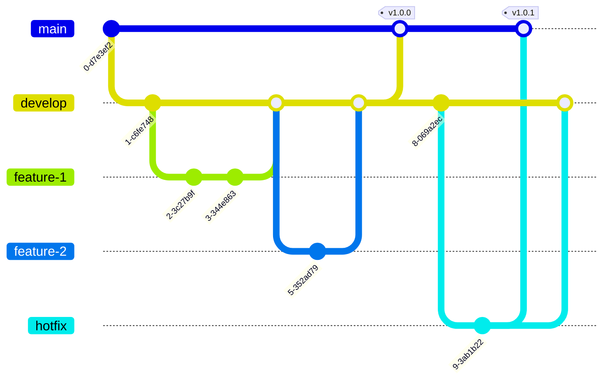

# Mermaid Diagram Templates

## Overview

This document contains Mermaid diagram templates for system architecture, data flows, and process visualization. You can render these directly in markdown viewers that support Mermaid, or use the Mermaid Live Editor at https://mermaid.live/

## 1. System Architecture Diagram


## 2. User Journey Flow


## 3. Data Flow Diagram


## 4. State Diagram


## 5. Sequence Diagram


## 6. Entity Relationship Diagram


## 7. Gantt Chart


## 8. Pie Chart


## 9. Git Flow Diagram



## 10. Class Diagram


## Usage Instructions

### In Markdown Files

1. Copy the desired diagram code including the ` ```mermaid ` markers
2. Paste into your markdown file
3. View in a Mermaid-compatible viewer (GitHub, GitLab, VS Code with extension)

### In Mermaid Live Editor

1. Go to https://mermaid.live/
2. Paste the diagram code (without the ` ```mermaid ` markers)
3. Edit and export as SVG, PNG, or PDF

### In Documentation

1. Include in your PRD or technical documentation
2. Update the diagram content to match your specific architecture
3. Keep diagrams version-controlled with your code

## Tips

- Keep diagrams simple and focused on one aspect
- Use consistent naming conventions
- Add comments in complex diagrams
- Consider breaking large diagrams into smaller, focused ones
- Update diagrams as the system evolves

---

_For more Mermaid syntax and examples, visit: https://mermaid.js.org/_
