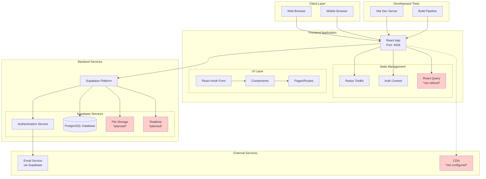
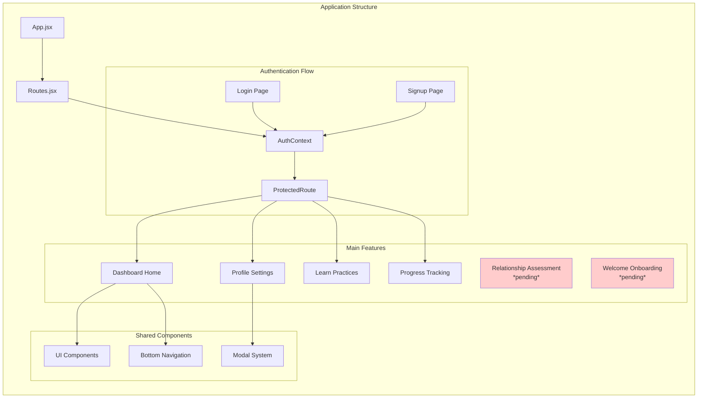
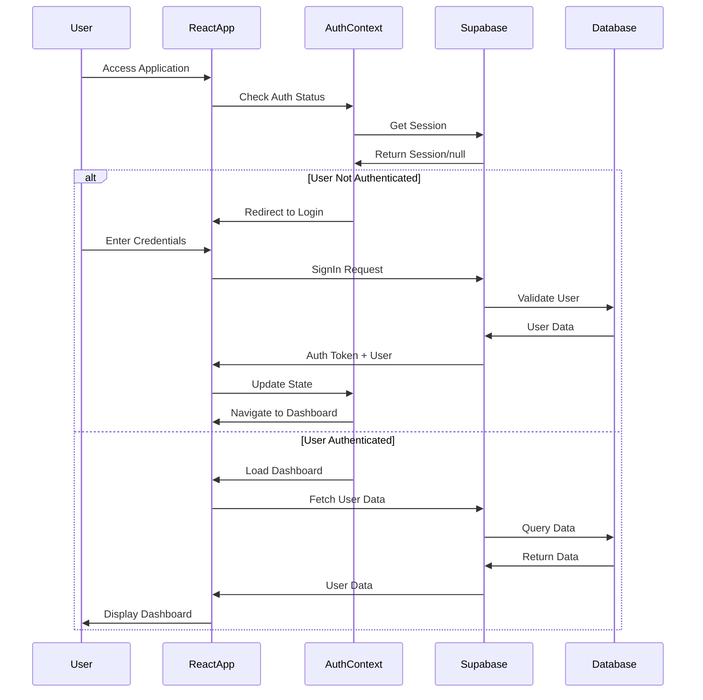
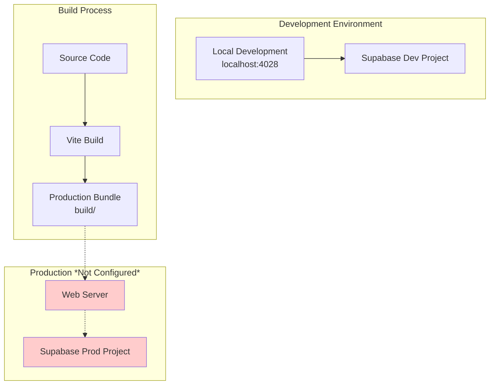
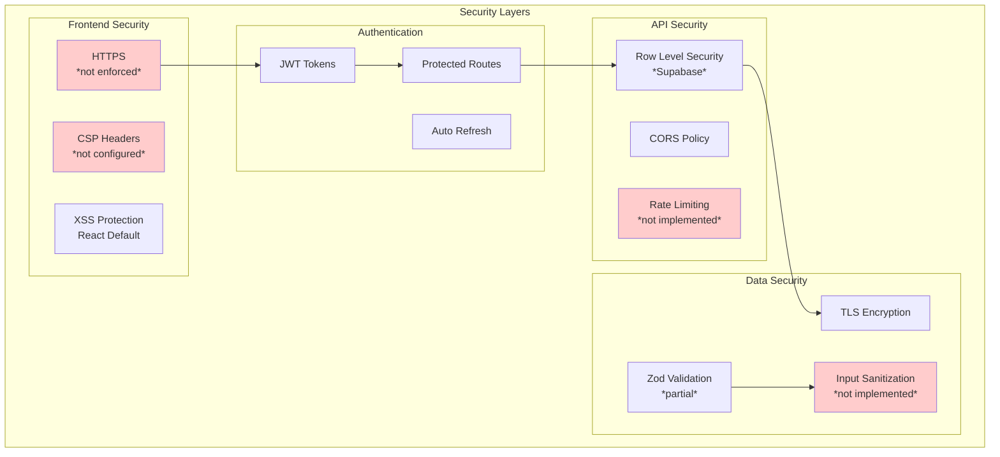
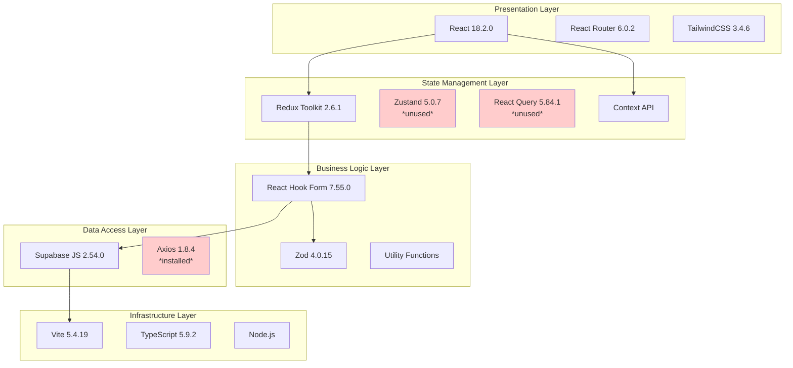
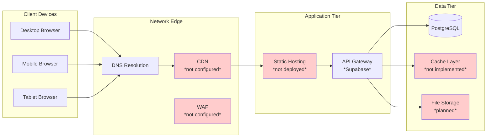

# Kasama.ai System Architecture

## Current Architecture Overview

## Component Architecture

## Data Flow Architecture

## Deployment Architecture (Current)

## Security Architecture

## Technology Stack Layers

## Network Architecture

---

**Legend:**

- 🟢 Green: Implemented and working
- 🟡 Yellow: Partially implemented
- 🔴 Red: Not implemented/configured
- Dotted lines: Planned/future connections
